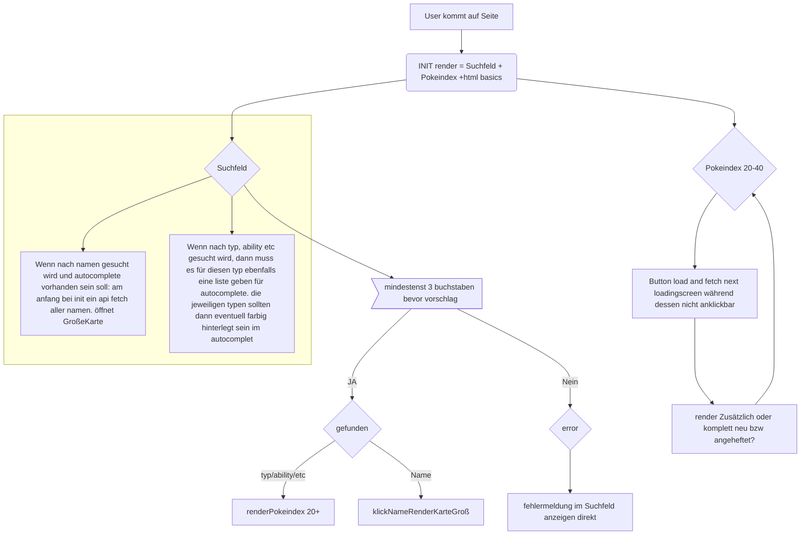
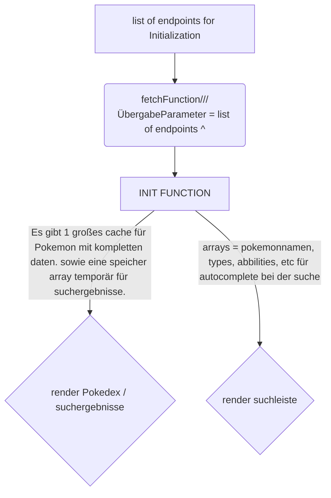

# Pokedex Ablauf

## Pokedex API - Documentation takeaways:

* default limit = 20 -> limit=X zum get request hinzufügen als parameter. offset wird bei -> next        automatish umd das limit erhöht.
    * API RESOURCE LIST(type): count(anzahl resources zu diesem endpoint), next(url), previous(url), results
        * Unnanmed endpoints: 
            *  characteristic, contest-effect, evolution-chain, machine, super-contest-effect endpoints are unnamed, the rest are named.
* unamed geben named results urls zumindest bei evoloution chain, diese müssen wieder gefetcht werden am besten for schleife nutzen.

### Fluss Diagramm: 



## Flussdiagramm takeaways:

Beim initialisieren, benötige ich bereits fetches die ausgeführt werden. 

* 1x für die erten Pokemon im Pokedex evoloution chain
    * hier ein weiterer fetch für die result url
* 1x für alle Namen von Pokemon
* 1x für alle Typen von Pokemon

fetch Daten werden mein hauptarbeits daten sein. Logik baut um diese herum auf für rendern suchen.

* hier am besten destruktion benutzen für bessere übersicht(weniger x[i].[i] etc)`? bisher nicht möglich einfache variablen zuweisung zu x[i] ist einfacher. Was ist der usecase von destruction?



```