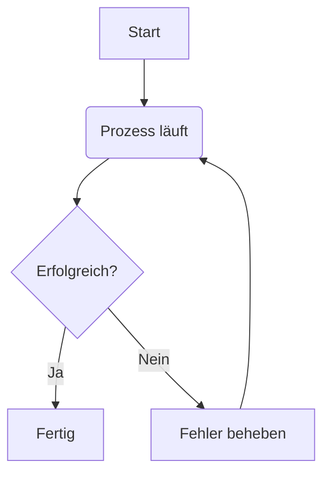

# Mein Projekt-Ablauf

Hier ist die Übersicht, wie der Prozess funktioniert:

```mermaid
graph TD
    A[Start] --> B(Prozess läuft)
    B --> C{Erfolgreich?}
    C -->|Ja| D[Fertig]
    C -->|Nein| E[Fehler beheben]
    E --> B
```

Dieser Text wird dann automatisch gerendert.